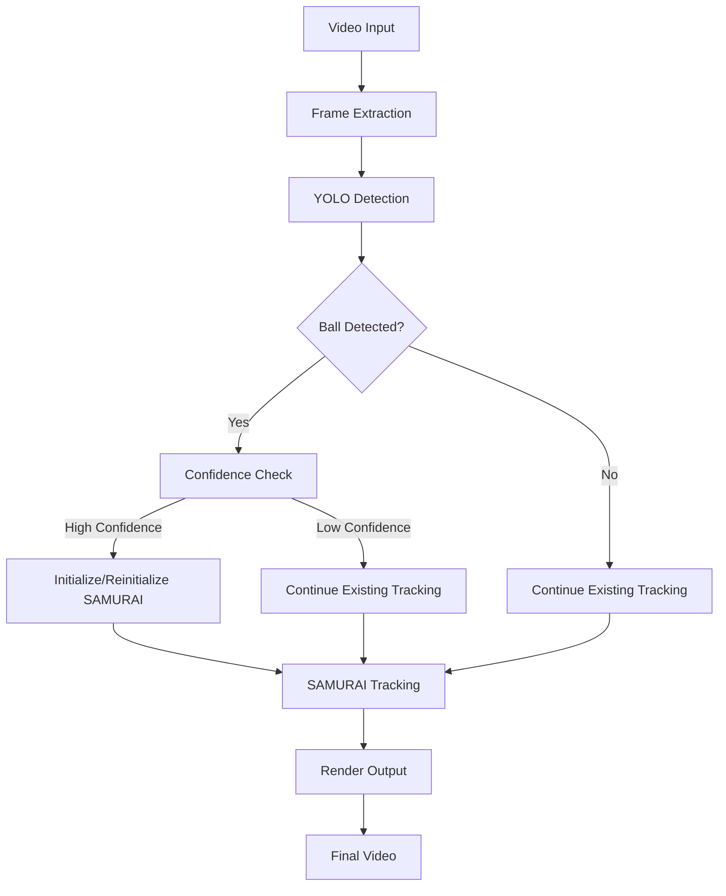

# Ball Detection and SAMURAI Tracking Pipeline Specification

## Overview

This document specifies the architecture and logic for a ball detection and tracking pipeline that integrates YOLO for ball detection with SAMURAI for single-object tracking.

## Architecture



## Core Logic

The pipeline implements the following decision logic for each frame:

```python
if bbox & confidence >= threshold:
    if not tracking:
        initialize_samurai_tracking(bbox)
    else:
        reinitialize_samurai_tracking(bbox)
elif bbox & confidence < threshold:
    if tracking:
        continue_tracking()
    else:
        wait_for_better_detection()
else:  # no bbox
    if tracking:
        continue_tracking()
    else:
        wait_for_detection()
```

## Processing Flow

### Phase 1: YOLO Detection
1. **Video Processing**: Process entire video using `model(video_path, stream=True)`
2. **Detection Caching**: Store all detections with frame indices and confidence scores
3. **Result Format**: Each detection includes `[x, y, w, h]` bbox and confidence value

### Phase 2: SAMURAI Tracking
1. **Frame-by-Frame Processing**: Iterate through video frames
2. **Detection Application**: Apply pre-computed detections to each frame
3. **Tracking Logic**: Implement confidence-based tracking decisions
4. **Mask Generation**: Generate segmentation masks for tracked objects

### Phase 3: Rendering
1. **Visual Overlays**: Draw bounding boxes, masks, and status information
2. **Color Coding**: 
   - Green: High-confidence detections (≥ threshold)
   - Orange: Low-confidence detections (< threshold)
   - Red: SAMURAI tracking masks
3. **Status Display**: Show current pipeline state and tracking duration

## Implementation Details

### YOLO Integration
- **Model Path**: `/root/ultralytics/runs/detect/train9/weights/best.pt`
- **Environment**: `ultralytics` conda environment
- **Processing**: Single-pass video processing with streaming
- **Output**: Dictionary mapping frame indices to (bbox, confidence) tuples

### SAMURAI Integration
- **Model**: `sam2.1_hiera_large.pt` (configurable)
- **Environment**: `base` conda environment
- **Initialization**: Uses video path for `init_state`
- **Tracking**: Continuous tracking with bbox reinitialization

### Performance Optimizations
- **Batch Detection**: YOLO processes entire video at once
- **Memory Management**: Periodic garbage collection and CUDA cache clearing
- **Efficient Rendering**: Minimal frame copying and overlay operations

## Status States

The pipeline tracks the following states:

1. **`tracking_initialized`**: First successful detection and tracking start
2. **`tracking_reinitialized`**: High-confidence detection reinitialized tracking
3. **`low_confidence_continue_tracking`**: Low-confidence detection, continuing existing tracking
4. **`no_detection_continue_tracking`**: No detection, continuing existing tracking
5. **`tracking_failed`**: Failed to initialize tracking
6. **`tracking_reinit_failed`**: Failed to reinitialize tracking

## Configuration Parameters

- **Confidence Threshold**: Default 0.5, configurable via command line
- **Device**: Default CUDA:0, supports CPU fallback
- **Model Paths**: Configurable YOLO and SAMURAI model paths
- **Output Format**: MP4 with configurable codec

## Error Handling

- **Model Initialization**: Graceful failure with informative error messages
- **Video Processing**: Handles corrupted frames and I/O errors
- **Memory Management**: Automatic cleanup and resource management
- **Tracking Failures**: Continues processing with fallback behavior

## Future Enhancements

- **Multi-object Tracking**: Support for tracking multiple balls simultaneously
- **Real-time Processing**: Optimization for live video streams
- **Advanced Visualization**: User-configurable overlay styles and information display
- **Performance Metrics**: FPS monitoring and optimization suggestions
